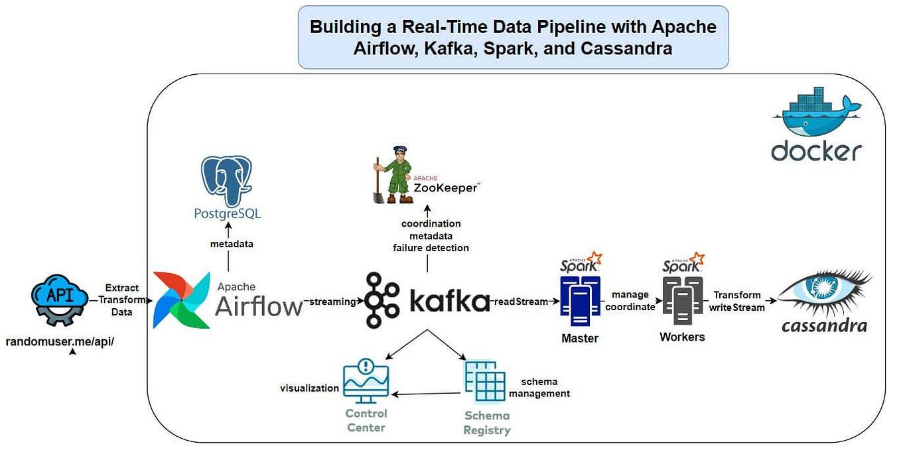
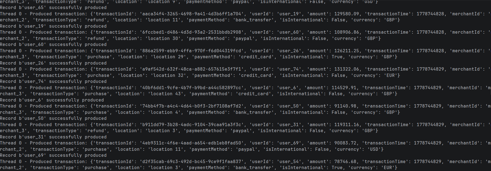
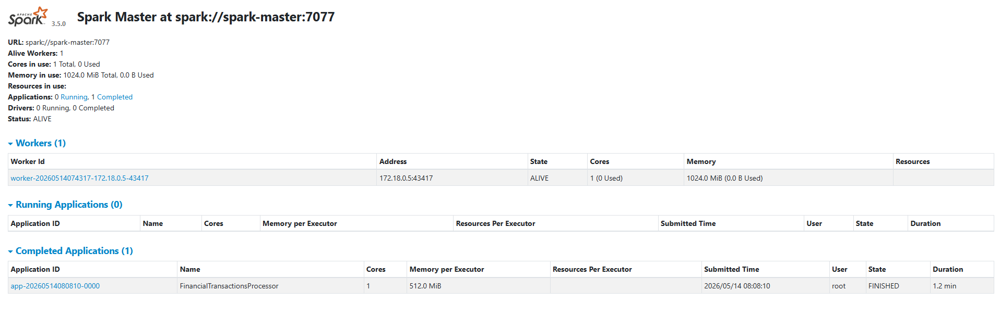
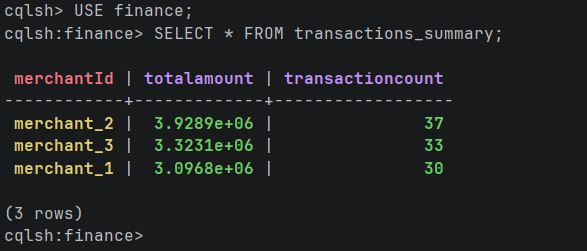

# 🚀 Financial Transactions Streaming Pipeline

A real-time data engineering project that simulates financial transactions and processes them using **Apache Kafka**, **Apache Spark Structured Streaming**, and **Cassandra**. The entire pipeline is containerized using Docker for easy setup and scalability.

---
## Architecture


---
## Kafka Streaming


---
## Spark UI


---
## Cassandra Output


## 📌 Tech Stack

* Apache Kafka
* Apache Spark (Structured Streaming)
* Cassandra
* Docker & Docker Compose
* Python

---

## 📊 Architecture Overview

```
Producer → Kafka → Spark Streaming → Cassandra
                      ↓
               Aggregated Kafka Topic
```

---

## 📂 Project Structure

```
.
├── main.py                     # Kafka Producer
├── jobs/
│   └── spark_processor.py     # Spark Streaming Job
│
├── docker-compose.yml
├── requirements.txt
├── .gitignore
└── README.md
```

---

## ⚙️ Setup Instructions

### 1️⃣ Clone Repository

```bash
git clone https://github.com/your-username/financial-transactions-pipeline.git
cd financial-transactions-pipeline
```

---

### 2️⃣ Start All Services

```bash
docker-compose up -d
```

This will start:

* Kafka cluster
* Spark master & worker
* Cassandra

---

## 🗄️ Cassandra Setup (MANDATORY)

Before running the Spark job, create keyspace and table.

### Step 1: Open Cassandra Shell

```bash
docker exec -it cassandra cqlsh
```

---

### Step 2: Create Keyspace

```sql
CREATE KEYSPACE IF NOT EXISTS finance
WITH replication = {'class': 'SimpleStrategy', 'replication_factor': 1};
```

---

### Step 3: Use Keyspace

```sql
USE finance;
```

---

### Step 4: Create Table

```sql
CREATE TABLE transactions_summary (
    merchantId text PRIMARY KEY,
    totalAmount double,
    transactionCount int
);
```

---

⚠️ Must be done before running Spark job.

---

## ▶️ Running the Project

### 1️⃣ Run Kafka Producer (Host Machine)

```bash
python main.py
```

---

### 2️⃣ Run Spark Streaming Job (Inside Docker)

#### Step 1: Enter Spark Container

```bash
docker exec -it --user root spark-master bash
```

---

#### Step 2: Submit Spark Job

```bash
/opt/spark/bin/spark-submit \
--master spark://spark-master:7077 \
--packages org.apache.spark:spark-sql-kafka-0-10_2.12:3.5.0,com.datastax.spark:spark-cassandra-connector_2.12:3.5.0 \
--executor-memory 512m \
--driver-memory 512m \
/opt/spark/jobs/spark_processor.py
```

---

## 📈 Features

* Real-time transaction simulation
* Kafka topic auto-creation
* Spark Structured Streaming processing
* Aggregation by merchant
* Cassandra data storage
* Fault-tolerant streaming (checkpointing)
* Fully Dockerized setup

---

## 📊 Data Fields

* transactionId
* userId
* merchantId
* amount
* transactionTime
* transactionType
* location
* paymentMethod
* isInternational
* currency

---

## ⚠️ Important Notes

* Spark job runs inside Docker container
* Cassandra table must be created before execution
* Kafka broker config must match Docker network
* Checkpoint folders are auto-created (ignored in git)

---

## 🧠 Learning Outcomes

* Real-time data pipelines
* Kafka + Spark integration
* Stream processing & aggregation
* Cassandra integration
* Docker-based distributed systems

---

## 👨‍💻 Author

Aman Arora

---

## ⭐ Support

If you found this project helpful, give it a ⭐ on GitHub!

---
